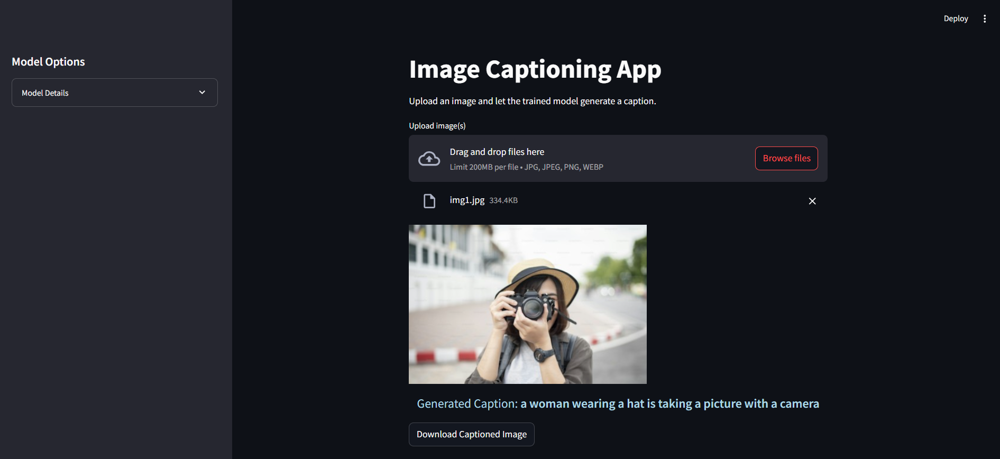

# <span style="color:#FFA500;"> ViT-ImageCaptioning</span>

A <span style="color:#00BFFF;">deep learning</span> project for automatically generating **descriptive captions** for images.  
It includes full <span style="color:#32CD32;">data preprocessing</span>, <span style="color:#32CD32;">model training</span>, and <span style="color:#32CD32;">evaluation</span> using **four model variants**:

  1. **ViT + Transformer**  
  2. **CNN + Transformer**  
  3. **CNN + LSTM**  
  4. **CNN + LSTM with Attention mechanism**  

> **Note:** Currently, only the **ViT + Transformer** model has been trained. The other variants have not been trained yet. The ViT model is still undergoing training and requires more time to reach optimal accuracy. Note that training this model is computationally intensive and can take long time.


## <span style="color:#1E90FF;"> Usage</span>

1. **Clone the repository:**
  ```bash
  git clone https://github.com/AhmedReda301/ViT-ImageCaptioning.git
  ```
2. **Install the required dependencies:**
  ```bash
  pip install -r requirements.txt
  ```
  ```bash
  python -q -m spacy download en_core_web_sm
  ```
3. **Download the model checkpoint (manual step):**  
   - ImgCap (ViT + Transformer): [Download checkpoint](https://huggingface.co/your_model_link/resolve/main/vit_transformer.pth)

4. **Run the main script:**
  ```bash
  python main.py
  ```

## <span style="color:#1E90FF;"> Sample Output:</span>


## <span style="color:#1E90FF;"> Dataset:</span>

The **Flickr30k** dataset consists of 31,784 images, each accompanied by five captions.  
It provides a wide variety of scenes and objects, making it ideal for diverse image captioning tasks.

**To download the dataset, follow these steps:**

1. Enable Kaggle’s public API by following the instructions [here](https://www.kaggle.com/docs/api).  
2. Run the following command to download the dataset:
```bash
kaggle datasets download -d hsankesara/flickr-image-dataset -p /path/to/data/Flickr30

   


